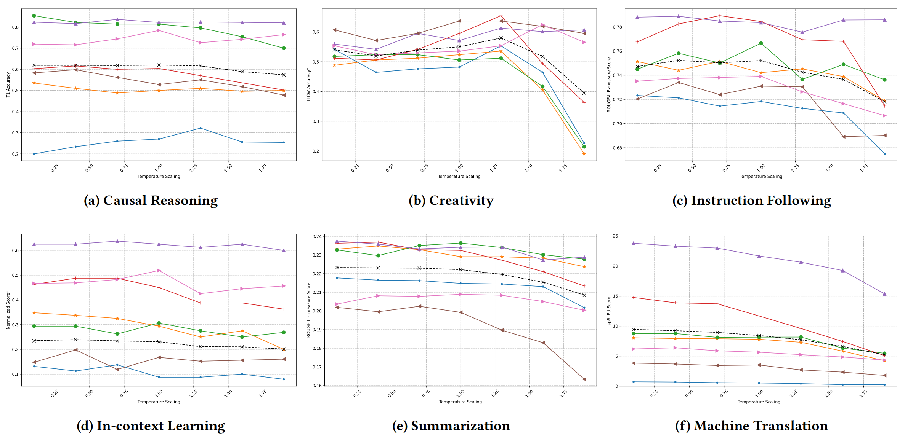
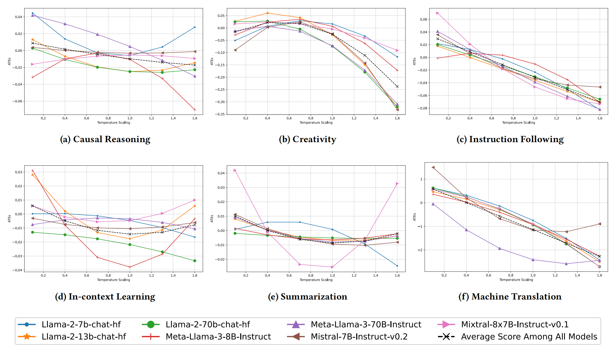

# Temperature_eval

This is a respository for evaluation and visulization of the results obtaining from observations. This is the respository acoomplanied by the following paper:

> **Hot N Cold: A Comprehensive Analysis of Temperature on the Performance of Llms**

  

## Abstract

> When employing Large Language Models (LLMs) on different tasks, a crucial hyperparameter to alternate is the sampling temperature, typically adjusted through logarithmic probability indicating the level of randomness. Recent research focuses on empirical performance analysis within a single scenario and one specific ability, without providing a comprehensive causality analysis encompassing several use cases.  Furthermore, identifying the optimal temperature for specific applications (use case/task) remains a significant challenge in research and industry contexts. In this work, we provide a comprehensive study to understand the behavior and capabilities of LLMs at various sampling temperatures. By following the first two levels of the causality ladder,  association and intervention. This paper shifts the focus on the effect of temperature from general mixed-task benchmarks to examine six distinct-specific abilities, by developing both statistical and causal models, thereby providing a thorough causality analysis and guidelines for optimal temperature settings.
## Abilities
This respository mainly contains several LLM abilities evaluations include: 

- **Causal Reasoning (CR)**: A cognitive faculty historically ascribed solely to humans that derive conclusions from given premises by adhering to strict logical principles.
- **Creativity (CT)**: An ability defined involves generating novel and valuable ideas, concepts, or products which require both originality and effectiveness.
- **Instruction Following (IF)**: This reflects the crucial ability to adhere to instructions presented in prompts, particularly important in the application of LLMs.
- **In-Context Learning (ICL)**: The emerging verified ability reflects the skill to comprehend text and perform tasks within its context and few examples, and this skill has become a new paradigm for natural language processing (NLP).
- **Summarization (SUM)**: This entails condensing lengthy texts or discussions into concise and informative summaries, while preserving key information and main ideas.
- **Machine Translation (MT)**: MT is a subfield of computational linguistics, and LLMs have shown outstanding potential in translating text from one language to another.

## How to use it?

This project mainly shows the results obtained during the research and accepts all comments. This data is uploaded in CSV files in the data folder. The statistical evaluation is in `evaluation_{ability_name}.ipynb` and the causal modeling is used in `causal_modelling_complete_base.ipynb`. Readers can check the CSV files obtained during the research to see if there are any intuitions for future research. Here, we show the empirical results and causal estimation results to give you an intuition about how to set temperature during your LLMs application pipeline.

<em>Figure 1: Empirical results.</em>

<em>Figure 2: Causal estimation results.</em>

## Outcome Data

The file names inside each folder of data are of two types:

- `exp_result_{model_id}_{time_generated}_{project_id}.csv`
- `exp_result_{model_id}_{time_generated}_{project_id}_evaluated.csv`

The file without `_evaluated` contains all the inferences for the model. The file with `_evaluated` contains additional columns for performance evaluation. The column details are easy to understand. If you have any questions, please contact my personal email: lilujun588588@gmail.com.
