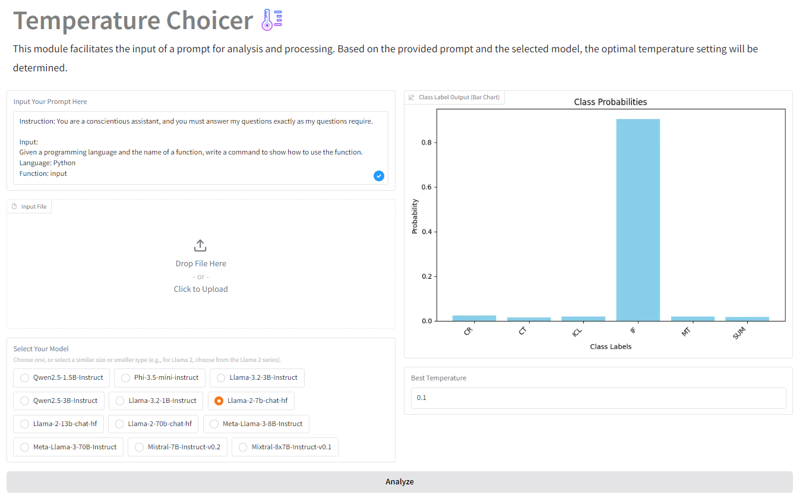
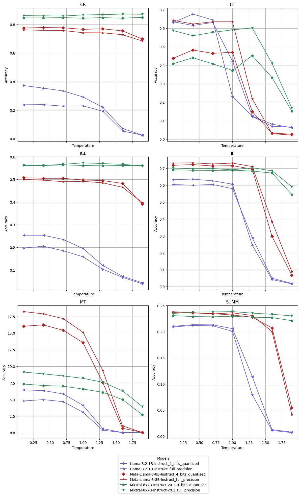

# Temperature_eval


This repository serves as a tool to identify the optimal temperature settings for a given prompt and model, leveraging findings from the following paper:

**Exploring the Impact of Temperature on Large Language Models: Hot or Cold?**

<p align="center">
  
</p>


This tool provides a structured guide for usage, starting with the **Prompt Input Section**, where users input a **prompt** and select a **model** for evaluation. Afterward, clicking the **"Analyze"** button initiates the process, utilizing the **[Volavion/bert-base-multilingual-uncased-temperature-cls](https://huggingface.co/Volavion/bert-base-multilingual-uncased-temperature-cls)** model, which is **pre-trained** and **fine-tuned** for temperature classification without requiring special permissions. The output includes a **bar chart** visualizing class label probabilities and a **"Best Temperature"** text box showing the **optimal temperature** derived from the model's performance distribution. The basic UI of this tool is shown in the following image, which allows you to input either a prompt or a file to determine the optimal temperature for your use cases.
<p align="center">
  
</p>


<!-- 
## Abilities

This tool is designed to classify six key abilities of large language models (LLMs): **Causal Reasoning (CR)**, the ability to derive conclusions based on logical principles; **Creativity (CT)**, involving the generation of novel and effective ideas; **Instruction Following (IF)**, reflecting adherence to prompts and guidelines; **In-Context Learning (ICL)**, showcasing the capacity to learn and perform tasks using contextual examples; **Summarization (SUM)**, which condenses lengthy texts while preserving key points; and **Machine Translation (MT)**, enabling accurate translation between languages. Based on these classifications, the tool identifies and reports the best temperature for optimal performance. -->


## How to use

Follow the steps below to configure the environment and install the required dependencies for the tool:

1. **Create and Activate the Conda Environment**  
   Execute the following commands to set up a dedicated Conda environment:  
   ```bash
   conda create -n env_temperature_eval python=3.10
   conda activate env_temperature_eval
   ```

2. **Install Dependencies**  
   Install the necessary Python libraries using `pip`:  
   ```bash
   pip install gradio transformers torch matplotlib
   ```
   
3. **Start the Tool**  
   
   Launch the server by running the main script:  
   ```bash
   python main_start.py
   ```

   After the server starts, a link will appear in the terminal. Click on this link to access and interact with the tool. Follow the steps below depending on your desired operation:

   1. **Single Prompt Temperature Selection**:  
      - Input your prompt directly into the tool.  
      - Select the most suitable model based on the **model selection guidelines** provided.  
      - The tool will calculate and display the best temperature for your prompt.

   2. **Batch Prompt Temperature Selection**:  
      - Upload a CSV file containing your prompts.  
      - Ensure the file has at least one column named **"input"** to represent your prompts.  
      - The tool will process all prompts and determine the best temperature for each.

   3. **Classification Only**:  
      - If you are only interested in classification results, use the model **[Volavion/bert-base-multilingual-uncased-temperature-cls](https://huggingface.co/Volavion/bert-base-multilingual-uncased-temperature-cls)** as per the guidelines.  
      - This model is fine-tuned for temperature classification tasks.

   By following these steps, you can effectively use the tool for both single-prompt and batch-prompt operations, as well as for classification tasks.


### Model Selection Guidelines

When selecting a model, if your specific model is **not listed** in the provided options, choose one with a **similar number of parameters**. Research indicates that models with similar parameter counts tend to exhibit **comparable performance variations** when adjusting for temperature changes. To make the best choice, find the model closest to yours in **parameter count**. For instance, if you are using a **Llama 3.1 8B** model, the optimal match would be **Meta-Llama-3-8B-Instruct** from the **Llama 3 series**.

### Additional Experimental results

This parts shows addtional Experimental reuslts contains: 

1. Complete FP16 quantization testing results.
2. Full SuperGLUE accuracy testing results.

**As for comoplete FP16**, the table presented in the paper already serves as a strong indicator of performance differences. However, in this section, we additionally provide a line chart to offer a more comprehensive visualization, allowing readers to gain deeper insights into the impact of transitioning from 4-bit quantized inference to FP16 inference. As shown in [Figure 1](#fig-precision), it can be observed that model performance is slightly reduced by quantization, but the overall trend of performance variation with temperature remains consistent. With the exception of CT, where it is observed that 4-bit quantization results in a 34\% loss of performance in Meta-Llama-3-8B-Instruct, it is concluded that for innovative writing tasks or solving complex problems with LLMs, full-precision models are still preferable. It was also noticed that the quantized version of Llama-3.2-1B-Instruct performs slightly better than the full-precision model on CR. However, since its accuracy is below 0.33, similar to random guessing (33\%), it is believed that quantization may make the model more prone to random guesses.

<div align="center">
<figure id="fig-precision">
  
  <figcaption><strong></strong></figcaption>
</figure>
</div>


Regarding the **Full SuperGLUE accuracy testing results**, in this paper, we present results for only three tasks from the SuperGLUE benchmark, where we observe significant performance improvements, especially for small and medium-sized models, compared to the 1.0 baseline temperature. However, due to page limitations, we are unable to include all findings. Notably, we also obtained some interesting results when comparing the baseline temperature of 1.0 to 0.1 across the entire SuperGLUE benchmark. The results are presented in the following table.
  


<div align="center">

| **Model**                        | **Type**  | **Default T = 0.1** | **Default T = 1.0** |
|-----------------------------------|----------|---------------------|---------------------|
| **Llama-3.2-1B-Instruct**         | \(ACC_D\) | 0.4474              | 0.4661              |
|                                   | \(ACC_B\) | **0.4526**          | 0.4608              |
|                                   | \(ACC_C\) | **0.4616**          | **0.4889**          |
| **Meta-Llama-3-8B-Instruct**      | \(ACC_D\) | 0.6889              | 0.6831              |
|                                   | \(ACC_B\) | **0.6905**          | **0.6941**          |
|                                   | \(ACC_C\) | 0.6858              | **0.6879**          |
| **Mixtral-8x7B-Instruct-v0.1**    | \(ACC_D\) | 0.7444              | 0.7420              |
|                                   | \(ACC_B\) | 0.7436              | 0.7420              |
|                                   | \(ACC_C\) | 0.7437              | 0.7418              |

</div>

   
- \( ACC_D \), \( ACC_B \), and \( ACC_C \) denote the accuracy values corresponding to distinct temperature configurations.  
- \( ACC_D \): Accuracy achieved under a fixed default temperature of 0.1 and 1.0.  
- \( ACC_B \): Accuracy obtained by dynamically adjusting the temperature based on a fine-tuned BERT model.  
- \( ACC_C \): Accuracy obtained using GPT-based prompting. 

Our analysis demonstrates that competitive performance can still be achieved when comparing the baseline temperatures of 0.1 and 1.0. The model exhibits performance gains relative to the baseline across the SuperGLUE benchmark, which comprises over 20,000 questions. These results further highlight the effectiveness of our temperature selection mechanism, as it consistently ensures optimal performance, particularly for smaller models. Given the increasing trend toward smaller models, such as OpenAI’s O3 Mini, and the adoption of lower-precision computations, temperature selection becomes increasingly critical in maintaining model performance.

## License

This project is licensed under the MIT License. You are free to use, modify, and distribute the code and its derivatives under the terms of this license. For more details, please refer to the [LICENSE](LICENSE) file.


## Citation

If you use this tool or the associated paper in your work, please cite us.

## Good News

We are pleased to observe that the guidelines for temperature settings published by the DeepSeek team align with the findings presented in our paper. The detailed guidelines can be found at the following link: [DeepSeek Temperature Settings](https://api-docs.deepseek.com/quick_start/parameter_settings). The DeepSeek team provides specific temperature recommendations for various tasks, as outlined below:

- **Coding / Math**: 0.0  
- **Data Cleaning / Data Analysis**: 1.0  
- **General Conversation**: 1.3  
- **Translation**: 1.3  
- **Creative Writing / Poetry**: 1.3  

These settings are carefully tailored to the different cognitive demands of each task. For tasks involving coding and mathematical reasoning, which require causal reasoning abilities, a lower temperature (close to 0) is optimal, as this promotes more deterministic outputs. This recommendation is consistent with the findings from our research.

Conversely, higher temperature values are more suitable for tasks such as creative writing or poetry, where greater diversity in responses is desirable. Furthermore, for larger models such as DeepSeek R1, which boasts more than 685 billion parameters, it is advisable to use a higher temperature. This approach is in line with our own recommendations for larger-scale models, as a higher temperature can help address more complex problems.

In conclusion, the temperature guidelines provided by DeepSeek corroborate our results and shows our valuable contributions for task-specific temperature adjustments, which can be further leveraged for models with varying parameter sizes. And finally, we truly want to emphasize that temperature really matters.


